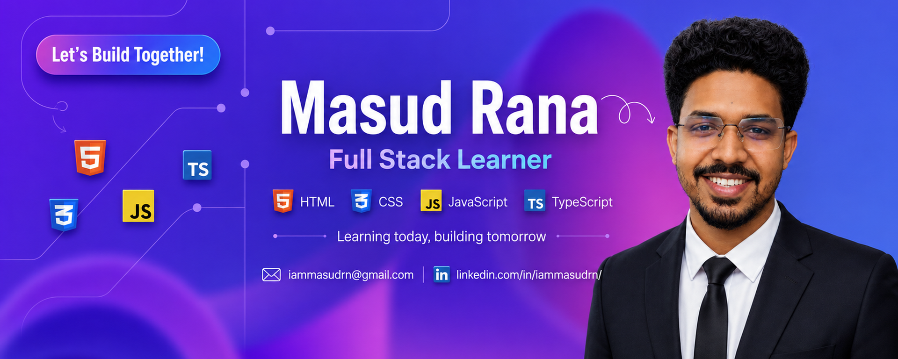

<!--- banner --->

<h1 align="center">Hi 👋, I'm Masud Rana</h1>
<h3 align="center">Aspiring Full-Stack Developer</h3>

  

- 🔭 I'm currently working on **a Nextjs project.**

- 🌱 I'm currently learning **React, NextJS.**

- 👯 I'm looking to collaborate on **open source project**

- 🤝 I'm looking for help with **learning system design**

- 💬 Ask me about **JavaScript, TypeScript**

- 📫 How to reach me **iammasudrn@gmail.com**

<h3 align="left">Connect with me:</h3>

<h3 align="left">Languages and Tools:</h3>

 

